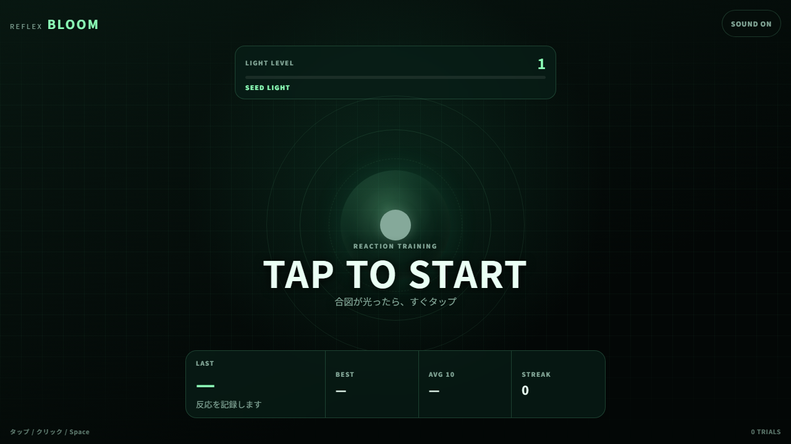
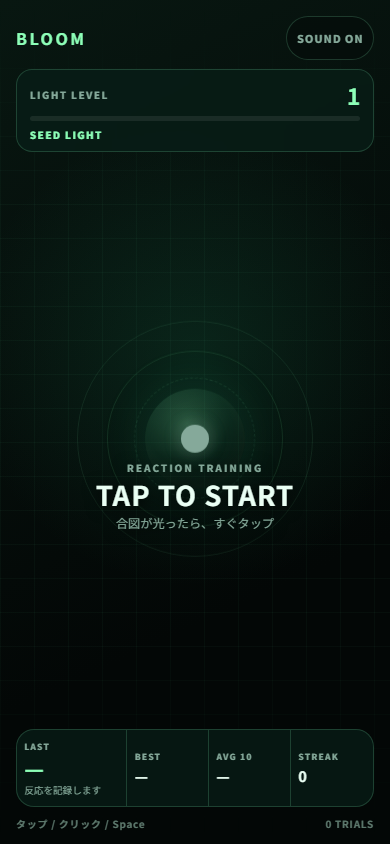
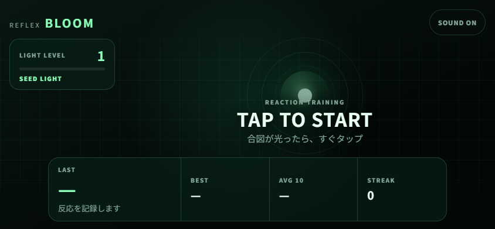
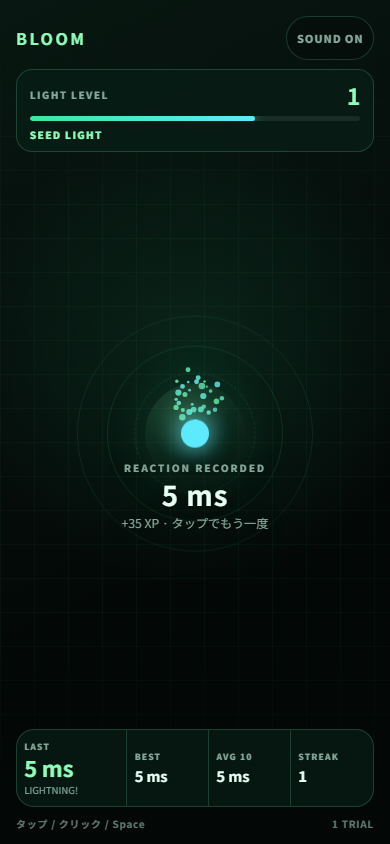
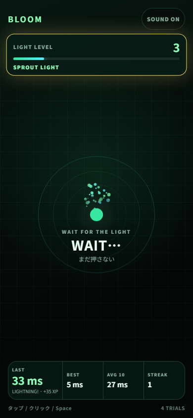

# REFLEX BLOOM 初期アプリレビュー

## 確認した範囲

PC 1280×720、スマホ縦390×844、スマホ横844×390の開始画面を実ブラウザ描画で確認した。測定状態遷移は自動テストと600試行シミュレーションで確認し、実端末の入力遅延、音、振動、楽しさは人レビューへ残した。

## 画面

### PC

主要な育成情報、反応領域、結果欄が一画面に収まり、開始操作が中心にある。

### スマホ縦

初回撮影ではHeadless Edgeの最小ウィンドウ幅による誤った切り取りが発生したため、DevToolsの端末幅エミュレーションで再検証した。390px幅ではSOUND、育成、開始、4つの結果欄がすべて収まる。

### スマホ横

育成情報を左、反応領域を中央、結果を下へ配置し、390pxの高さに主要機能が収まる。

### スマホ結果

実ブラウザで開始、ランダム待機、合図、プレイヤー入力、結果表示までを通し、実行時例外0件で測定値、XP、ベスト、平均、連続数が更新された。

## 自動検証で確認できたこと

- 早押し、成功、時間切れの全状態へ到達
- 反応時間の開始・終了イベントが分離されている
- 育成前後で同じ247msを記録し、育成補正がない
- レベルと全成長段階へ到達可能
- 結果表示から次試行まで0ms
- プレイヤー入力なしの自動測定確定を拒否
- 育成進捗を保存し、進行中状態は復元しない

## 人が必ず確認すること

- 合図の視認性と体感反応値
- 900〜2600msの待機が緊張感になるか
- 数回のレベルアップで成長を感じるか
- 発光、音、振動を繰り返して不快でないか
- PCと実スマホで測定値にどの程度差が出るか
- 1〜5分遊んだ際の集中疲労

自動レビューはpassしているが、人レビューが完了するまで公開ゲートは閉じる。

## 試遊後のループ継続性レビュー

スマホ試遊で、成功結果の後に次待機を始めるためのタップが必要な点を摩擦として検出した。次操作可能時間はすでに0msだったが、追加入力数は1回残っていた。

成功タップを測定確定と継続意思の両方に使い、結果とXPを下部に残したまま次の待機へ自動遷移するよう変更した。次の測定結果は引き続き次のプレイヤータップだけが確定するため、Player Agency Contractには違反しない。早押しと時間切れは認識が必要なため手動再開のままとする。

実ブラウザでは、成功値とXPが下部へ残り、中央が追加操作なしで`WAIT…`になり、実行時例外0件で次の合図待機へ進むことを確認した。

